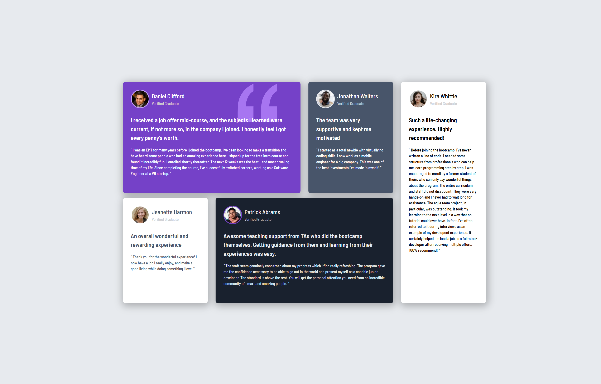

# Frontend Mentor - Testimonials grid section solution

This is a solution to the [Testimonials grid section challenge on Frontend Mentor](https://www.frontendmentor.io/challenges/testimonials-grid-section-Nnw6J7Un7). Frontend Mentor challenges help you improve your coding skills by building realistic projects.

## Table of contents

- [Overview](#overview)
  - [The challenge](#the-challenge)
  - [Screenshot](#screenshot)
  - [Links](#links)
- [My process](#my-process)
  - [Built with](#built-with)
  - [What I learned](#what-i-learned)
  - [Continued development](#continued-development)
  - [Useful resources](#useful-resources)
- [Author](#author)

## Overview

This project is a responsive testimonials grid section built as part of a Frontend Mentor challenge. The goal was to create a visually appealing layout that adapts seamlessly to different screen sizes using modern CSS techniques. The component displays multiple user testimonials in a grid, emphasizing accessibility and clean design. It was a great opportunity to practice CSS Grid, Flexbox, and a mobile-first workflow, as well as to reinforce best practices in semantic HTML and component-based development.

### The challenge

Users should be able to:

- View the optimal layout for the site depending on their device's screen size

### Screenshot

### Links

- Solution URL: [Add solution URL here](https://your-solution-url.com)
- Live Site URL: [Add live site URL here](https://your-live-site-url.com)

## My process

### Built with

- Semantic HTML5 markup
- CSS custom properties
- Flexbox
- CSS Grid
- Mobile-first workflow

### What I learned

During this project, I deepened my understanding of CSS Grid and Flexbox for building responsive layouts. I learned how to combine these techniques to create a flexible grid that adapts to different screen sizes. I also practiced using semantic HTML to improve accessibility and maintainability. Additionally, I gained experience with CSS custom properties, which made it easier to manage colors and spacing throughout the project.

### Continued development

In future projects, I want to continue focusing on:

- Deepening my understanding of advanced CSS Grid and Flexbox layouts, especially for more complex responsive designs.
- Improving accessibility by learning more about ARIA roles and best practices for semantic HTML.
- Refining my use of CSS custom properties for better scalability and maintainability.
- Practicing performance optimization techniques, such as minimizing CSS and improving load times.
- Enhancing my workflow with better version control and automated testing tools.
- Continuing to study design systems and how to implement consistent UI patterns across projects.

### Useful resources

- [Basic concepts of grid layout](https://developer.mozilla.org/en-US/docs/Web/CSS/CSS_grid_layout/Basic_concepts_of_grid_layout#grid_areas) - CSS grid layout introduces a two-dimensional grid system to CSS. Grids can be used to lay out major page areas or small user interface elements. This guide introduces the CSS grid layout and the terminology that is part of the CSS grid layout specification.

## Author

- Frontend Mentor - [@remainhumble](https://www.frontendmentor.io/profile/remainhumble)
- X(formerly Twitter) - [@thiflan120699](https://x.com/thiflan120699)

